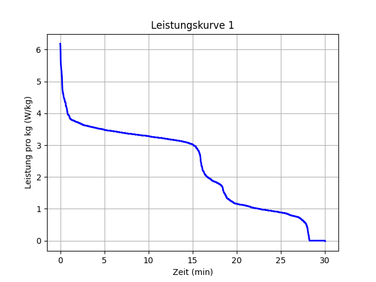
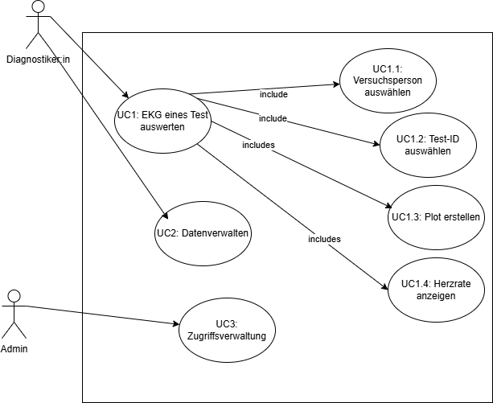

# Projekt_gesamt

Hier drinnen sollen alle Aufgaben für die Programmierübung des Sommersemester 2025 bearbeitet werden

## Funktionsumfang
Hier liegt ein Skript "min.py", mit dem wir eine Leistungskurve plotten.

## Anforderungen und Nutzung

### Zum Installieren des Projekts
- Repository clonen
- 'pdm install' in Powershell-Terminal schreiben, um dem Projekt zu Grunde liegende Bbliotheken und Versionen zu installieren.

- Die Beispieldaten liegen im Ordner 'data' unter 'activity.csv'

### Zum Starten des Projekts
- Im Ordner 'source' die Datei 'power_curve.py ausführen

## Beispielergebnis

# EKG-App

## Funktionsbeschreibung
Die App soll __Diagnostiker:in__ ermöglichen, EKG_Daten verschiedener Patienten zu erfassen, zu speicher und auszuwerten. Die App soll eine einfache und intuiteve Benutzeroberfläche bierten, um die Bedienung zu erleichtern.
Der __Admin__ kann __Diagnostiker:in__ anlegen.

### Use Cases
- UC1: EKG eines Tests auswerten
    UC1.1: ...
- UC2:

## Implementierung
__USe Case 1__ Die User Journey für die Diagnostiker:in, wenn sie einen Test auswerten möchte, folgt aus dem Activity Diagramm:

### Design

Hier folgen erste Entwürfe eines UI Designs. Das Design ist für die Darstellung auf einem PC optimiert (Querformat). Keine seperaten Frames.